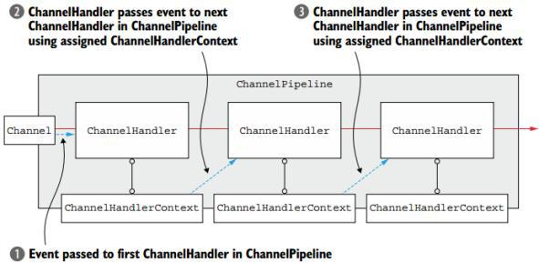
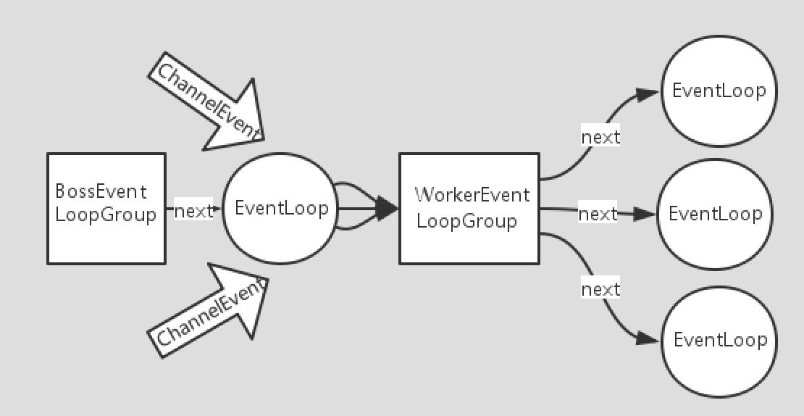
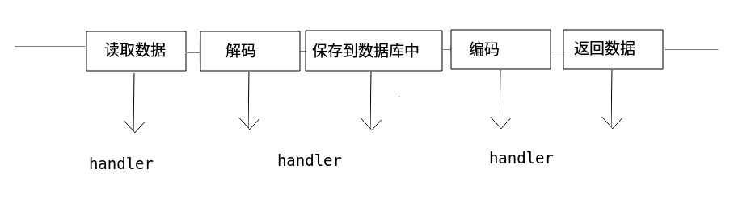
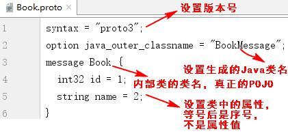
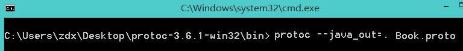

# Netty-Demo

### 核心API

- ChannelHandler 
  我们经常需要自定义一个 Handler 类去继承 ChannelInboundHandlerAdapter,然后通过重写相应方法实现业务逻辑
  - public void channelActive(ChannelHandlerContext ctx),通道就绪事件
  - public void channelRead(ChannelHandlerContext ctx, Object msg),通道读取数据事件
  - public void channelReadComplete(ChannelHandlerContext ctx) ,数据读取完毕事件
  - public void exceptionCaught(ChannelHandlerContext ctx, Throwable cause),通道发生异常事件

- Pipline 和 ChannelPipline

  ChannelPipeline 是一个 ***Handler 的集合***,它负责处理和拦截 inbound 或者 outbound 的事件和操作,相当于一个***贯穿 Netty 的链***

  

  - ChannelPipeline addFirst(ChannelHandler... handlers),把一个业务处理类(handler)添加到链中的***第一个***位置
  - ChannelPipeline addLast(ChannelHandler... handlers),把一个业务处理类(handler)添加到链中的***最后一个***位置

- ChannelHandlerContext

  这是事件处理器***上下文对象***, Pipeline链中的***实际处理节点***.每 个 处理节点ChannelHandlerContext 中包含一个具体的事件 处理器 ChannelHandler , 同 时ChannelHandlerContext 中也绑定了对应的 pipeline 和 Channel 的信息,方便对ChannelHandler
  进行调用。常用方法如下所示:

  - ChannelFuture close(),关闭通道
  - ChannelOutboundInvoker flush(),刷新
  - ChannelFuture writeAndFlush(Object msg) , 将数据写到 ChannelPipeline 中当前ChannelHandler 的下一个 ChannelHandler 开始处理(出站) 

- ChannelOption

  做一些参数设置 

  - ChannelOption.SO_BACKLOG
  - ChannelOption.SO_KEEPALIVE

- ChannelFuture 

  表示Channel中***异步I/O***操作的结果 在Netty中所有的I/O操作都是异步的,I/O 的调用会直接返回,

  Channel channel() 返当前正在进行IO操作的通道

  ChannelFuture sync() 等待异步操作执行完成

- EventLoopGroup  和 其实现类 NioEventLoopGroup

  EventLoopGroup 是一组 EventLoop 的抽象,Netty 为了更好的利用多核 CPU 资源,一般会有多个 EventLoop 同时工作,每个EventLoop 维护着一个 Selector 实例。

  通常一个服务端口即一个 ServerSocketChannel 对应一个 Selector 和一个 EventLoop 线程。BossEventLoop 负责接收客户端的连接并将 SocketChannel 交给 WorkerEventLoopGroup 来进行 IO 处理

  

  - public NioEventLoopGroup() 构造方法

  - public Future<?> shutdownGracefully() 断开连接 关闭线程

    

- ServerBootstrap 和 Bootstrap

  ServerBootstrap 服务器端启动助手

  Bootstrap 客户端启动助手
  - public ServerBootstrap group(EventLoopGroup parentGroup, EventLoopGroup childGroup),该方法用于服务器端,用来设置两个 EventLoop

  - public B group(EventLoopGroup group) ,该方法用于客户端,用来设置一个 EventLoop

  - public B channel(Class<? extends C> channelClass),该方法用来设置一个服务器端的通道实现

  - public <T> B option(ChannelOption<T> option, T value),用来给 ServerChannel 添加配置

    public <T> ServerBootstrap childOption(ChannelOption<T> childOption, T value),用来给接收到的通道添加配置

  - public ServerBootstrap childHandler(ChannelHandler childHandler),该方法用来设置业务处理类(自定义的 handler)

  - public ChannelFuture bind(int inetPort) ,该方法用于服务器端,用来设置占用的端口号

    public ChannelFuture connect(String inetHost, int inetPort) ,该方法用于客户端,用来连
    接服务器端

- Unpooled 类

  操作缓冲区的工具类

  public static ByteBuf copiedBuffer(CharSequence string, Charset charset),通过给定的数据和字符编码返回一个 ByteBuf 对象(类似于 NIO 中的 ByteBuffer 对象)

=-= code in com.abelrose.basic =-=

------

### 网络聊天案例

=-= code in com.abelrose.chat =-=

------

### 编码和解码

数据在网络中传输的都是***二进制***的数据,所以需要编码和解码

在Java中可以用序列化的操作 完成解码和编码

但是: 

- 无法跨语言(硬伤)
- 序列化后体积太大
- 序列化性能太低

Netty 有自家的codec(内部仍然是序列化)

- StringDecoder  字符串解码
- ObjectDecoder 对象解码
- StringEncoder  字符串编码
- ObjectEncoder 对象编码

Google 的 Protobuf

- 支持跨平台 多语言
- 高性能 高可靠
- 使用 protobuf 编译器能够自动生成代码 protobuf是将类的定义用 .proto 文件进行描述 然后通过protoc.exe 生成 .java

 

sc.pipeline().addLast("decoder",new ProtobufDecoder(BookMessage.Book.getDefaultInstance()));